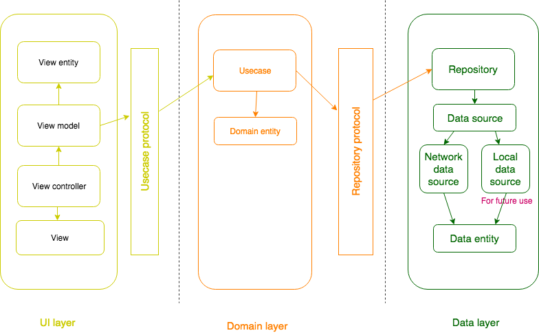

# Image Search - iOS

This app is similar to the Flickr search

## Features:
- Endless scrolling of search results
- 3 column scrollable view of images
- Auto search as you type
- Image caching 

## Built With

Swift 4.2

## App Architecure - MVVM + Clean Architecture

I have implemented the app using MVVM + Clean Architecture 

The layers that form my architecture are:
- UI layer
- Domain layer
- Data layer

Each layer is independent of other layer. They are communicate through only protocals.

### UI layer

- I have used MVVM for UI layer.
- View model communicate to the usecase to get data.
- View controller fetch the data from model and present the view.
- UI layer has its own view entities different than domain entities.
- Caching the images using NSCache

### Domain layer

- Domain layer does not know anything about other layers, just fetches data from a repository defined as a protocol and returns the result.
- Domain layer has its own domain entities different than view data entities.
- Domain layer shouldn’t know where the data comes from.

### Platform layer

- It uses Repository Pattern
- With repository pattern we can query our model objects from different data sources (Core Data, Realm, web server, etc.) with a only single-entry point. For now we have only  web server.

## Author

* **Karthi Anandhan**

